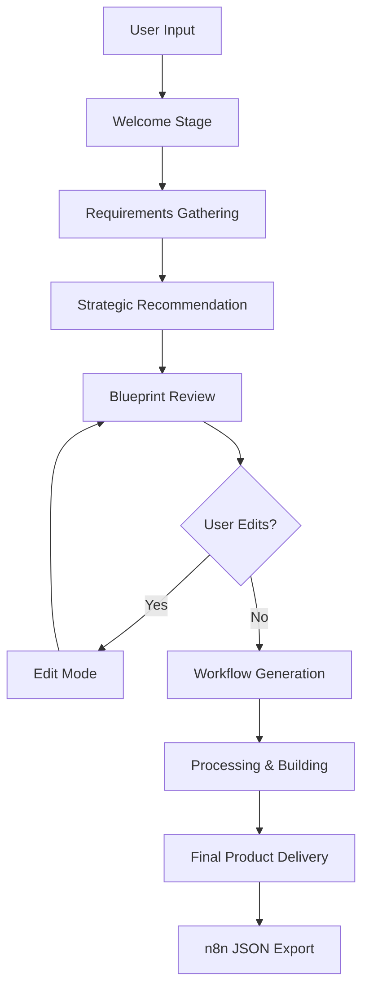

# 🤖 Heph Agent Factory

> **Intelligent Multi-Agent Workflow Generator for n8n Automation**

🌐 **[Live Demo](https://kcbpsnomp9yhsm2zmcykau.streamlit.app/)**

[](https://streamlit.io/)
[](https://python.org/)
[](https://docker.com/)
[](https://n8n.io/)

## 🎯 Purpose

Heph Agent Factory is an intelligent multi-agent system that transforms natural language automation requirements into production-ready n8n workflows. By leveraging advanced AI reasoning and workflow pattern recognition, it bridges the gap between business needs and technical implementation.

## 🏗️ Multi-Stage Wizard Architecture

### 🏠 **Stage 1: Welcome & Requirements**
- **Purpose**: Goal collection and requirement gathering
- **Function**: Captures user automation needs and specific details
- **Output**: User goal and configuration parameters (calendar email, sheet URL, etc.)

### 🎯 **Stage 2: Strategic Recommendation**
- **Purpose**: Technology assessment and recommendation
- **Function**: Presents n8n vs custom solution options with recommendations
- **Output**: Technology choice validation (n8n workflow recommended)

### � **Stage 3: Blueprint Review & Edit**
- **Purpose**: Technical specification refinement
- **Function**: Displays machine-optimized prompt with editing capabilities
- **Output**: Finalized technical implementation plan

### 🔄 **Stage 4: Workflow Generation**
- **Purpose**: n8n JSON creation and processing
- **Function**: Simulates workflow building with loading states
- **Output**: Processing confirmation and transition to final stage

### � **Stage 5: Final Product Delivery**
- **Purpose**: Workflow delivery and export
- **Function**: Presents complete n8n JSON with copy functionality
- **Output**: Production-ready n8n workflow JSON

## 🚀 System Workflow



## 🎯 Key Features

### ✨ **Intelligent Analysis**
- Natural language processing for automation requirements
- Context-aware feasibility assessment
- Strategic technology recommendations

### 🔄 **Multi-Stage Wizard**
1. **Welcome Stage**: Goal definition and requirement specification
2. **Strategic Stage**: Technology recommendation and approach validation  
3. **Blueprint Stage**: Technical specification review and customization
4. **Generation Stage**: Workflow building and processing simulation
5. **Delivery Stage**: Final n8n JSON export and deployment guidance

### 🎨 **Enhanced UI/UX**
- Glowy red input boxes with responsive focus states
- Dark theme with optimal contrast ratios
- One-click workflow copying and deployment
- Progressive disclosure of complexity

### 🔧 **Technical Capabilities**
- Real-time workflow validation
- Error handling and recovery
- Modular agent architecture
- Containerized deployment ready

## 📊 Current Training Data

The system has been trained on **limited n8n workflows** covering:
- Calendar and scheduling automations
- Email notification systems
- Data synchronization workflows
- Conflict detection and resolution
- Multi-service integrations

## 🚀 Future Scaling Plans

### 📈 **Massive Dataset Ingestion**
- **Target**: Ingest entire repositories containing **thousands of n8n workflows**
- **Source**: Community workflows, enterprise patterns, integration libraries
- **Benefit**: Exponentially improved pattern recognition and workflow generation

### 🧠 **Enhanced Intelligence**
- **Pattern Recognition**: Learn from thousands of real-world implementations
- **Best Practices**: Automatically incorporate proven workflow patterns
- **Optimization**: Generate more efficient and robust workflows
- **Specialization**: Domain-specific workflow expertise (CRM, Marketing, DevOps, etc.)

### 🔮 **Advanced Capabilities**
- **Auto-Testing**: Generate test cases for workflows
- **Performance Optimization**: Analyze and optimize workflow execution
- **Integration Recommendations**: Suggest optimal service combinations
- **Workflow Variants**: Generate multiple implementation options

## 🛠️ Technology Stack

### **Frontend**
- **Streamlit**: Interactive web interface
- **Custom CSS**: Enhanced styling and animations
- **Session Management**: Multi-stage workflow persistence

### **Backend** 
- **FastAPI**: RESTful API services
- **Python 3.11**: Core logic and AI integration
- **Multi-Agent Framework**: Distributed processing architecture

### **Infrastructure**
- **Docker**: Containerized deployment
- **Docker Compose**: Multi-service orchestration
- **Health Checks**: Service monitoring and recovery

##  Project Structure

```
heph/
├── app/
│   ├── main_ui.py          # Streamlit frontend interface
│   └── Dockerfile          # Frontend container configuration
├── agents/
│   ├── main_service.py     # FastAPI backend service
│   └── Dockerfile          # Backend container configuration
├── docker-compose.yml      # Multi-service orchestration
├── requirements.txt        # Python dependencies
├── runtime.txt            # Python version specification
└── README.md              # This file
```

## 🎯 Use Cases

### **Business Automation**
- Meeting room booking systems
- Customer onboarding workflows
- Invoice processing automation
- Lead qualification pipelines

### **Data Integration**
- CRM to marketing platform sync
- Multi-database synchronization
- API data aggregation
- Real-time analytics pipelines

### **Communication Workflows**
- Notification cascades
- Alert management systems
- Team coordination automation
- Customer communication flows
