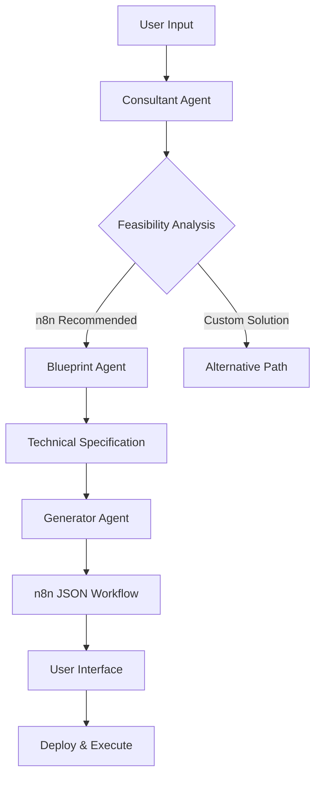

# 🤖 Heph Agent Factory

> **Intelligent Multi-Agent Workflow Generator for n8n Automation**

[](https://streamlit.io/)
[](https://python.org/)
[](https://docker.com/)
[](https://n8n.io/)

## 🎯 Purpose

Heph Agent Factory is an intelligent multi-agent system that transforms natural language automation requirements into production-ready n8n workflows. By leveraging advanced AI reasoning and workflow pattern recognition, it bridges the gap between business needs and technical implementation.

## 🏗️ Multi-Agent Architecture

### 🧠 **Consultant Agent**
- **Role**: Requirements analysis and feasibility assessment
- **Function**: Analyzes user input to determine optimal automation approach
- **Output**: Strategic recommendations (n8n vs custom solutions)

### 🔧 **Blueprint Agent** 
- **Role**: Technical specification and workflow design
- **Function**: Converts requirements into detailed technical prompts
- **Output**: Machine-optimized n8n workflow specifications

### ⚡ **Generator Agent**
- **Role**: JSON workflow creation and validation
- **Function**: Produces production-ready n8n workflow JSON
- **Output**: Complete, importable n8n workflows

### 🎨 **Interface Agent**
- **Role**: User experience and interaction management
- **Function**: Manages multi-stage wizard interface
- **Output**: Seamless user journey from idea to implementation

## 🚀 System Workflow



## 🎯 Key Features

### ✨ **Intelligent Analysis**
- Natural language processing for automation requirements
- Context-aware feasibility assessment
- Strategic technology recommendations

### 🔄 **Multi-Stage Workflow**
1. **Welcome Stage**: Requirement gathering and clarification
2. **Strategic Stage**: Technology recommendation and validation
3. **Blueprint Stage**: Technical specification and editing
4. **Generation Stage**: Workflow creation and optimization
5. **Delivery Stage**: JSON export and deployment guidance

### 🎨 **Enhanced UI/UX**
- Glowy red input boxes with responsive focus states
- Dark theme with optimal contrast ratios
- One-click workflow copying and deployment
- Progressive disclosure of complexity

### 🔧 **Technical Capabilities**
- Real-time workflow validation
- Error handling and recovery
- Modular agent architecture
- Containerized deployment ready

## 📊 Current Training Data

The system has been trained on a **curated set of n8n workflow examples** covering:
- Calendar and scheduling automations
- Email notification systems
- Data synchronization workflows
- Conflict detection and resolution
- Multi-service integrations

## 🚀 Future Scaling Plans

### 📈 **Massive Dataset Ingestion**
- **Target**: Ingest entire repositories containing **thousands of n8n workflows**
- **Source**: Community workflows, enterprise patterns, integration libraries
- **Benefit**: Exponentially improved pattern recognition and workflow generation

### 🧠 **Enhanced Intelligence**
- **Pattern Recognition**: Learn from thousands of real-world implementations
- **Best Practices**: Automatically incorporate proven workflow patterns
- **Optimization**: Generate more efficient and robust workflows
- **Specialization**: Domain-specific workflow expertise (CRM, Marketing, DevOps, etc.)

### 🔮 **Advanced Capabilities**
- **Auto-Testing**: Generate test cases for workflows
- **Performance Optimization**: Analyze and optimize workflow execution
- **Integration Recommendations**: Suggest optimal service combinations
- **Workflow Variants**: Generate multiple implementation options

## 🛠️ Technology Stack

### **Frontend**
- **Streamlit**: Interactive web interface
- **Custom CSS**: Enhanced styling and animations
- **Session Management**: Multi-stage workflow persistence

### **Backend** 
- **FastAPI**: RESTful API services
- **Python 3.11**: Core logic and AI integration
- **Multi-Agent Framework**: Distributed processing architecture

### **Infrastructure**
- **Docker**: Containerized deployment
- **Docker Compose**: Multi-service orchestration
- **Health Checks**: Service monitoring and recovery

## 🚀 Quick Start

### **Local Development**
```bash
# Clone repository
git clone https://github.com/HarshaVardhani-5610/heph.git
cd heph

# Setup virtual environment
python -m venv .venv
source .venv/bin/activate  # On Windows: .venv\Scripts\activate

# Install dependencies
pip install -r requirements.txt

# Run Streamlit app
streamlit run app/main_ui.py
```

### **Docker Deployment**
```bash
# Build and run all services
docker-compose up --build

# Access application
# Frontend: http://localhost:8501
# Backend: http://localhost:8000
```

### **Cloud Deployment**
The application is optimized for deployment on:
- **Streamlit Cloud** (Recommended)
- **Railway**
- **Render**
- **AWS/GCP/Azure**

## 📂 Project Structure

```
heph/
├── app/
│   ├── main_ui.py          # Streamlit frontend interface
│   └── Dockerfile          # Frontend container configuration
├── agents/
│   ├── main_service.py     # FastAPI backend service
│   └── Dockerfile          # Backend container configuration
├── docker-compose.yml      # Multi-service orchestration
├── requirements.txt        # Python dependencies
├── runtime.txt            # Python version specification
└── README.md              # This file
```

## 🎯 Use Cases

### **Business Automation**
- Meeting room booking systems
- Customer onboarding workflows
- Invoice processing automation
- Lead qualification pipelines

### **Data Integration**
- CRM to marketing platform sync
- Multi-database synchronization
- API data aggregation
- Real-time analytics pipelines

### **Communication Workflows**
- Notification cascades
- Alert management systems
- Team coordination automation
- Customer communication flows

## 🤝 Contributing

We welcome contributions to enhance the multi-agent capabilities:

1. **Fork** the repository
2. **Create** a feature branch (`git checkout -b feature/amazing-agent`)
3. **Commit** your changes (`git commit -m 'Add amazing agent capability'`)
4. **Push** to the branch (`git push origin feature/amazing-agent`)
5. **Open** a Pull Request

## 📈 Roadmap

- [ ] **Q1 2025**: Massive workflow dataset ingestion
- [ ] **Q2 2025**: Advanced pattern recognition algorithms
- [ ] **Q3 2025**: Domain-specific agent specialization
- [ ] **Q4 2025**: Enterprise-grade deployment options

## 📄 License

This project is licensed under the MIT License - see the [LICENSE](LICENSE) file for details.

## 🙏 Acknowledgments

- **n8n Community** for providing excellent automation platform
- **Streamlit Team** for the intuitive web framework
- **OpenAI** for enabling intelligent agent capabilities

---

<div align="center">

**Built with ❤️ by the Heph Team**

[🌐 Live Demo](https://your-streamlit-app.streamlit.app) | [📖 Documentation](https://github.com/HarshaVardhani-5610/heph/wiki) | [🐛 Report Bug](https://github.com/HarshaVardhani-5610/heph/issues)

</div>
